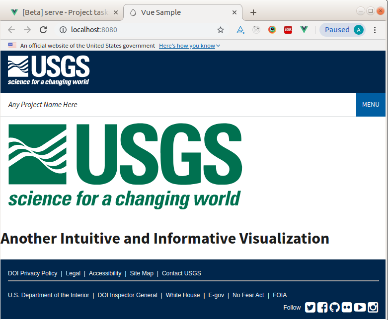
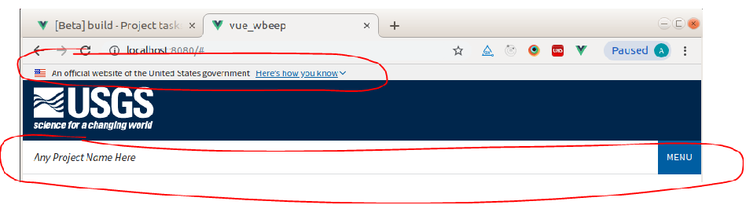

# Step by Step Project Setup
With the information provided, you can build a website using the Vue framework that incorporates both the US Web Design System (USWDS) and the standard USGS headers and footers.

Image 1: Example of Final Product 


### Background
Vue CLI (command line interface) is a full system for rapid Vue.js development that provides project scaffolding, a instantly updating development server, a graphic user interface and much more. Vue CLI is not Vue.js; it is Vue.js plus many additional user friendly features. Vue CLI is not required to create a Vue.js project, but it is a slick way of doing so.

### Install Vue CLI globally
Use Node Package Manager (NPM) to install Vue CLI. You will need to have Node.js installed on your system for this to work. You can test if you have Node.js installed with this command.
```
node -v
```
Node.js contains NPM. If you don't have it, do an internet search for 'install node.js' and follow the instructions. Once NPM is ready, you can install Vue CLI. Install this globally using the '-g' option so that it will be available from any directory while working from the command line. 

```
npm install -g @vue/cli
```
## Create Your Project
##### Create Your Project - option 1 -The Lazy way (the smart way?)
Clone or download this project. For more information on Git cloning check out the documentation on GitHub.

If your goal is to use this project as the base for a new project, the best path is to use the 'Download ZIP' option found under the 'Clone of download' button on the repository main page. The ZIP file has the .git file removed, and will allow you to 'git init' and then upload this project into a new repository with a clean git history.

Once the project is cloned or downloaded you can jump down a few sections in this document until you reach the section on 'Generalized Setup Information.' If you need more guidance, jump back up a bit to the section on 'Running the Project.'

##### Create Your Project - option 2 -The Step by Step Way
This section will lead you through creating a Vue project that utilizes the US Web Design System (USWDS) and the standard USGS headers and footers.

##### Step One - Use Vue to Scaffold your project
Vue provides two ways to layout the basic skeleton of a project, the command line or through the Vue CLI user interface (Vue UI) on a Linux based operating system (if you are using a different operating system, you will need to do some investigating on your own for setup, sorry). Once the project is created, we will add the headers and footers as Vue components and connect the USWDS to the project through a node module.

Choice one - use the command line
```
vue create my-project-name
```
The command above requests the Vue application to run the 'create' command using the command line argument 'my-project-name' as the name of the project, of course this name can be any (operating system permissible) name you like.

Once you run the 'create' command, Vue will walk you through the initial steps for creating your project with a series of prompts. The first prompt you will encounter is as follows:
```
Vue CLI v3.8.2
? Please pick a preset: (Use arrow keys)
❯ default (babel, eslint) 
  Manually select features 
```
Here we will choose 'Manually select features.' The first choice 'default' is would be fine, as we can change the configuration later, but since we would like to add a CSS postprocessor to the project we may as well do that now using the 'Manually select features' option.

The next set of prompts will ask what specific features we would like to add to our project. Vue will take our choices and use them to create a webpack.config file. Webpack is an application to bundle JavaScript modules. Webpack is notoriously hard to configure, however Vue thoughtfully creates then hides the webpack.config. As a note, directly modifying the webpack.config is highly discouraged in newer versions of Vue. Webpack changes should be by done creating a vue.config.js file in the project root directory and adding configuration there. However, to set up this project, Vue will take care of all the Webpack issues without additional configuration. 

For learning purposes we will keep this project as simple as we can, selecting only Babel (a JavaScript compiler, for ES6 compatibility), CSS Pre-processors, and Linter / Formatter. 

Other interesting options include a Router for URL construction on Single Page Applications, Vuex for state management, and a variety of unit test suits. But, we will ignore those for now to avoid complicating matters, and we can always add any of these features to a project at a later time.

```
Vue CLI v3.8.2
? Please pick a preset: Manually select features
? Check the features needed for your project: 
 ◉ Babel
 ◯ TypeScript
 ◯ Progressive Web App (PWA) Support
 ◯ Router
 ◯ Vuex
❯◉ CSS Pre-processors
 ◉ Linter / Formatter
 ◯ Unit Testing
 ◯ E2E Testing
```

The next prompt asks us to confirm our choice of CSS pre-processor. This pre-processor will do the work of converting any newer styling formats like SCSS back into CSS during the 'pre' step and then it will clean up and enhance the CSS in the 'pro' or 'post' step. For the lack reasons to choose something else, we will go with the 'Sass/SCSS (with node-sass)' option. There may be a better choice here, such as 'dart-sass,' but for now, we will stick with 'node-sass' since it is used in other USGS projects.
```
Vue CLI v3.8.2
? Please pick a preset: Manually select features
? Check the features needed for your project: Babel, CSS Pre-processors, Linter
? Pick a CSS pre-processor (PostCSS, Autoprefixer and CSS Modules are supported by default): 
  Sass/SCSS (with dart-sass) 
❯ Sass/SCSS (with node-sass) 
  Less 
  Stylus 
```
Next up is a selection of code linting options. One may be better than the others here but since there was not much information online describing the options, I just went with the basic choice. The linter choice should be consistent with in the team, so some discussion on this point may be warranted.

For the next option choose 'lint on save.' 

Then choose to place the config files for the various features into there own dedicated config files. In a small project leaving the configuration details in the package.json is fine. However, things will be a bit cleaner if we keep the package.json as simple as possible, and since Vue will do the work of creating all the files, why not let it.

The final prompt will ask if you would like to save your choices as a preset. Since our choices were pretty simple, there is not a need to save them. However, if setup becomes more complicated, saving a copy of the project setup to Amazon Web Services S3 might be a good path.

After hitting enter, Vue will begin creating the project. As the first step, Vue will download project dependencies to the local node_modules folder. This usually takes a few minutes. Vue will go through a few more steps and then return command line control back to you with a departing helpful hint telling you to change directories to that of your new project and then start the Vue development server to view the project. For greater detail on running Vue projects, scroll down to the 'Running the Project' section. 

At this point you have an operational Vue project and are ready to proceed to the step of adding the header and footer components.

Choice two - use the graphic user interface
```
vue ui
```
Telling Vue to run the 'ui' command will start a graphic user interface that will allow you to create and run your projects. The command can be run from any directory, provided that Vue was installed globally (as noted above). The Vue UI is well designed and fairly easy to understand, so I won't go deeply into details of use. The main idea is to find 'Vue Project Manager' screen and hit the 'create' button. At that point Vue UI will lead you through the same prompts as above.

##### Step Two - Add the USGS Header and Footer
The official USGS header, footer and related CSS styles is available at https://atthecore.usgs.gov/atom/975 . Download the 'USGS Web Application Visual Identity'folder to you local file system. The files are designed for use with Druple and generally require a bit of tweaking to get them to work. In reality, it will be easiest to use the header and footer sections from this repository. However, I wanted to show where the official versions are located on the off chance that anyone wanted to use the original source.

In the editor of your choice, you can now begin the process of creating the header and footer Vue components.  

Starting with the footer component, add a new file under src/components called FooterUSGS.vue (note that components start with capital letters). Inside that file add the three basic elements that are common to Vue conponents.
```
<template>
    
</template>


<script>
    
</script>


<style>
    
</style>
```  
Create a 'div' element inside the 'template' element and give it an id. For Vue to work, each 'template' element can have only one root element (root element is one in which all other elements are nested). Inside that 'div,' paste the HTML of the footer. 
```
<template>
    <div id="footer">
    </div>
</template>
```
Now we need to export the component as a JavaScript module. To do that, we add an export statement, in the form of a JavaScript object (JSON). This object will have a single key value pair. The key will be 'name' and the value will the name we choose for the module.
```
<script>
    export default {
        name: 'FooterUSGS'
    }
</script>
``` 
We will come back to the 'script' element in a minute. But for now, it is enough to know that this is where the CSS styles for the footer component will reside and that if we add the attribute 'scoped' to the element that any CSS inside it will only be applied to this, the footer component. This is important. If we don't 'scope' the CSS of any component, the styles will be applied globally, possibly producing strange effects. One final addition we will add at this point is a 'lang' attribute which Vue will use to call the correct 'loader'so that Webpack will properly process the styles. Since we will be using SCSS stylesheets, we will set the 'lang' attribute's value to 'SCSS'.   
```
<style scoped lang="scss">
    
</style>
```

Cool. Now we have created our first component. The next step is to register it so Vue knows it exists and what to do with it. 

The place where the action happens in Vue is in 'App.vue' which is located in /src. 'App.vue' is the main component, into which all the other components are assembled. Once all the pieces of 'App.vue' are together, 'App.vue' is dynamically inserted into the 'index.html' file, the 'root' file of most websites, for display by HTTP servers. 

Start by removing the contents of the 'template' element . . .
```
<template>
  <div id="app">
    
    <HelloWorld msg="Welcome to Your Vue.js App"/>
  </div>
</template>
```  
. . . so that it looks like:
```
<template>
  <div id="app">

  </div>
</template>
```
If the development server is running you will see that the site is now blank (if it is not running start it from the command line with 'npm run serve' or with Vue UI, go to 'tasks' (the clipboard icon), 'serve', then hit the 'run' button). Inspecting it with Dev Tools will show that there is an empty 'div' element with the id of 'app' This is the expected output since we just deleted the content of the 'div'. Let's fix that by adding our footer component.

The first step is to import the footer module. Do this in the 'script' element. 
```
<script>
import HelloWorld from './components/HelloWorld.vue'
import FooterUSGS from './components/FooterUSGS' // this line is the module import

export default {
  name: 'app',
  components: {
    HelloWorld,
    FooterUSGS (this registers the component, note you can't comment in JSON - so the parens part is not in the code)
  }
}
</script>
``` 
Now Vue knows about the footer component. To get the component to show, we just need to include the element in the 'template' like so:
```
<template>
  <div id="app">
    <FooterUSGS></FooterUSGS>
  </div>
</template>
``` 
Vue will see the 'footerUSGS' element in the 'template' element of 'App.vue' and dynamically insert the contents of the 'template' element we created in the footer component. Checking the development server again, we now have the footer without any styling. That is something we can fix. To start, we need to add a few new folders to store style related items.

Under /src create some folders: 'fonts', 'image', and 'style'. In those folders, put the content from USGS Visual Identity folder mentioned earlier (or just grab the content from this repository-much easier).

Now that we have all the styles, fonts etc. we need in the project, we just have to get them working. The first step, which if you copied the files from the repository you already have complete, is to combine the CSS files into a single stylesheet so that we don't have to import all the sheets individually.

To do this go into the style folder (/src/style/usgsHeaderFooter) and make a file called combinedLoad.css and add the following code.

When we used VueCLI (either through the command line or with the graphic user interface) to create the scaffolding of our project, a bit of magic happened in the background. Vue CLI went to work and configured Webpack so that the '@import' statement is active. Before Vue CLI, this would have required us manually configuring a SCSS loader for Webpack, but when we selected the pre-processor feature in the Vue CLI setup menu, this task was done for us. Pretty Sweet. Thanks Vue CLI.
```
@import "commonStyles.css";
@import "customStyles.css";
```
Adding the two '@import' statements to one file will allow us to make a single import of the 'combinedLoad.css' to get all styles from both the'commonStyles.css' and 'customStyles.css' stylesheets. It is not an essential task, but does save some time later and is illustrative of the how '@import' statements are used in Vue.

Now let's give this blah project some structure and color. Back in the footer component, FooterUSGS, add the line to tell Vue to import the combined stylesheet.
```
@import"../style/usgsHeaderFooter/combinedLoad.css";
```
Check the server output again, and blam! you've got a fully styled footer. If not, you totally screwed something up. Actually, it is probably nothing big, you may have missed named a folder when copying the style assets. 

Now that you have the basic idea of how Vue components work, you should be able to insert the header component. I won't walk you thorough that. If you get stuck, the repository will have the code you need. 

##### Step Three - Add the US Web Design System (USWDS)
Now that we have the headers and footers, let's add some stuff from the USWDS like the 'The official government website' banner and a dropdown selection menu. For those that haven't looked into the USWDS, it is a package of colors, styles, and code snippets that can be used to simplify and add design cohesiveness to websites run by the US Government.

Image 2: Example of USWDS Components 


The challenge here is that the USWDS is imported from a node module and that makes things a bit more complicated than directly including the stylesheets in our project. 

Since having followed all of the previous steps, you are now a seasoned Vue component creator, I will try to deal with tne main places where adding the USWDS components differ from adding the USGS header and footer and let you work through the remaining details.

Start by creating the components, just as you did the footer. Create a file for each component; call them HeaderUSWDSBanner and HeaderUSWDSSelections. 

Create the 'template', 'script', and 'style' elements in each file.

Export the module in the 'script'  element. For example, here is the export for HeaderUSWDSBanner.vue.
```
<script>
    export default {
        name: 'HeaderUSWDSBanner'
    }
</script>
```
Let's pause here for a moment. We need to get the USWDS into our project. Luckily, the designers of USWDS make it easy by packaging the system into a node module which we can grab with NPM.
On the command line, while in your project, directory run,
```
npm install --save uswds@latest
```
This will download, save USWDS to the package.json as a dependency, and install the package in the project. Once the process has completed, we are ready to add the styles to our components.

You will have to stop and restart the development server before Vue will have access to the new module. Once that is done, add the imports to each 'style' element of both the USWDS components you created. The creators of the USWDS module were considerate enough to build the project and bundle up the CSS prior to packaging it as a node module. Since the USWDS module is built and bundled, there is a directory in the module called 'dist'. This directory contain will contain a single stylesheet that has all the CSS of the entire USWDS. So to have all the styling power of the USWDS at our fingertips, we just need to tell Vue were to find it. The '@import' statement will do the job again, telling Webpack to use the 'loader' that Vue CLI set up for us when we initially created the project.   
```
<style  scoped lang="sass">
    @import '~uswds/dist/css/uswds.css'
</style>
```
Note how I did not use the relative path, but instead threw a tilde '~' at the front. This is a bit of Vue/Webpack shorthand. The tilde tells Vue (which tells Webpack) to look in the node_modules folder and import folder as a node module. 

As a note, the import of the CSS can be included in each component and restricted to that component with the 'scoped' attribute. You could also include it in the 'App.vue' 'style' element as a import that would be globally available. A third option is to remove the 'scoped' attribute in any 'style' element to cause the CSS in that element to be loaded globally. At this point, I am not sure what is best practice.

Alright, the 'script' and 'style' elements are done in the new components. To finish the USWDS components, use the code from the repository to populate the 'template' element. You could go to the Web, https://designsystem.digital.gov/components/header/ , and search the USWDS to get the header code, but for now, keep it simple and use the code in this repository. The only changes between the repository code and that of the USWDS are to the image paths, which we will look at in a bit, and the fact that I split the header code. The code from the USWDS contains both the banner and the selection header. I wanted the USGS header in between the USWDS banner and header, so I split the code into two components. 

With the new components created, now we need to register the components (tell Vue that they exist) and then tell Vue where to use them. Just like before, this is done in 'App.vue'. 

There are three steps to register and use a component in 'App.vue'
```
import the component in the 'script' element
export the component in the 'script' element
Use the new compenent as a new element in the 'template' element
```
If you need help, peek at 'App.vue' in the repository. When your work in 'App.vue' is complete, running the development server will give you the new USWDS elements, with a couple of little flaws. If you used the code snippets directly from the USWDS the images will not work. A second issue, is that there should be drop down menus that open and close. These menus are just stuck open. That is because the USWDS uses JavaScript to control the dropdown menus and we never told Vue how to import that JavaScript. Luckily, that JavaScript is in the node module we downloaded and installed.

Vue can load the JavaScript if we import the 'uswds' node module into the JavaScript. That is done in the 'main.js' file by adding two lines.
```
import Vue from 'vue'
import App from './App.vue'
import uswds from 'uswds' //add this line to tell Vue where to find the USWDS JavaScript

Vue.config.productionTip = false
Vue.use(uswds) // add this line to tell Vue to only load the uswds module once

new Vue({
  render: h => h(App),
}).$mount('#app')

```
The final issue to address is the image paths. If you went to https://designsystem.digital.gov/components/header/ and copied that code for the HeaderUSWDSSelections component you will find the images referenced as follows:
```

```
This will not work. The images are not in the assets folder of our project. The images are right where NPM placed them when it installed the USWDS module which is in the node_modules folder at the root of the project. Luckily this is not much of a problem for Vue as Vue allows us to access the USWDS node module assets directly by changing the code to this:
```

```
There is one more image to deal with and that is in the 'HeaderUSWDSSelections' component. There is a close box image that needs the same sort of change to path as we did above, so it will look like . . .
```
<button class="usa-nav__close"></button>
```
And that is all there is to it! Simple. Well not straight away, but it is light years simpler having Vue manage the JavaScript build than attempting to do the same process with a set of unrelated applications. 

Something to note at this point is how much of the build task Vue has done for us. If you have worked with JavaScript build tooling in the past, you will know that it is a squirrel-ly and complex affair. In the background, Vue used the power of Webpack to search our files and find code and assets (images, fonts, and the like) that needed to be gathered into our project with virtually no effort.    

##### Step Four - Adding Content to the Project
Now that the headers, footers, and USWDS are in place, the final part is adding some content. With the basic information from above and the code in the repository as a model, it should be possible to add a section of content like that shown in the example. The nice thing about Vue is that adding a new part to the web page means following the same pattern as adding any of the previous components.

This tutorial sets up a very basic page, but Vue is capable of creating much more complicated web applications. It is possible to do advanced HTML templating add URL routing and state management to our current application without major structural changes to the code, using only features included in Vue.   

### Running The Project
Vue CLI provides two main ways to run your project, the command line or through the Vue CLI user interface (Vue UI). 
To exercise the command line option, be sure are in your project directory and run the development server.
```
npm run serve
```
When you run the above line, NPM will look in the package.json file for any run scripts, particularly one that is labeled with the key 'serve.' The following is a snippet from this project's package.json file.
```
  "scripts": {
    "serve": "vue-cli-service serve",
    "build": "vue-cli-service build",
    "lint": "vue-cli-service lint"
  },
```
When Vue CLI created the project, it added these scripts to the package.json file. The exact scripts will vary depending on the options selected during setup. The scripts are presented in the form of a json object with key value pairs, the keys above are 'serve,' 'build,' and 'lint.' Typing any of the keys on the command line after the words 'npm run' will activate the script with which it is paired. For example, running 'npm run serve' will call the script 'vue-cli-service serve,' which runs the 'vue-cli-service' program with the 'serve' command. This command will start an HTTP server that will sense changes you make to the code and instantly update the contents of the displayed web page in a process called hot loading.

The second option to run the project is with Vue UI. Vue UI is a intuitive way of running, building, and configuring your projects. Vue UI is started with the following command.
```
vue ui
```
Unlike the 'command line' option above, Vue UI can be run from any directory. Once the UI starts, it is a pretty intuitive process to run the project--mainly a matter of finding the right button to push. If you need more help, there are many detailed guides online. 
### Building the Application
The only task left is to build the application and that is described in the next section under 'Compiles and minifies for production.

# Generalized Setup Information

## Project setup
Once the project is cloned locally, use Node Package Manager (NPM) to download and install all the needed project dependencies.
```
npm install
```

### Compiles and hot-reloads for development
To start a local server and run the project from the command line, use the  HTTP server built into Vue-cli with the following command. This will start a server and open a browser window.
```
npm run serve
```

### Compiles and minifies for production
To package the project for deployment use the following command. This will produce a 'dist' directory containing all the files required to run the project. Note that the project requires an HTTP server to view locally from the 'dist' folder.
```
npm run build
```
The dist directory is meant to be served by an HTTP server (unless you've configured publicPath to be a relative value), so it will not work if you open dist/index.html directly over file:// protocol. The easiest way to preview your production build locally is using a Node.js static file server. First, install server NPM package globally, Then run the project as follows.
```
npm install -g serve
# -s flag means serve it in Single-Page Application mode
# which deals with the routing problem below
serve -s dist
```
If you are using Vue Router in history mode, a simple static file server will fail. For example, if you used Vue Router with a route for /todos/42, the dev server has been configured to respond to localhost:3000/todos/42 properly, but a simple static server serving a production build will respond with a 404 instead.

To fix that, you will need to configure your production server to fallback to index.html for any requests that do not match a static file. The Vue Router docs provides configuration instructions for common server setups

### Run your tests
If you configured the project for tests, and have included them, they can be run with the following.
```
npm run test
```

### Lints and fixes files
```
npm run lint
```

### Customize configuration
See [Configuration Reference](https://cli.vuejs.org/config/).
